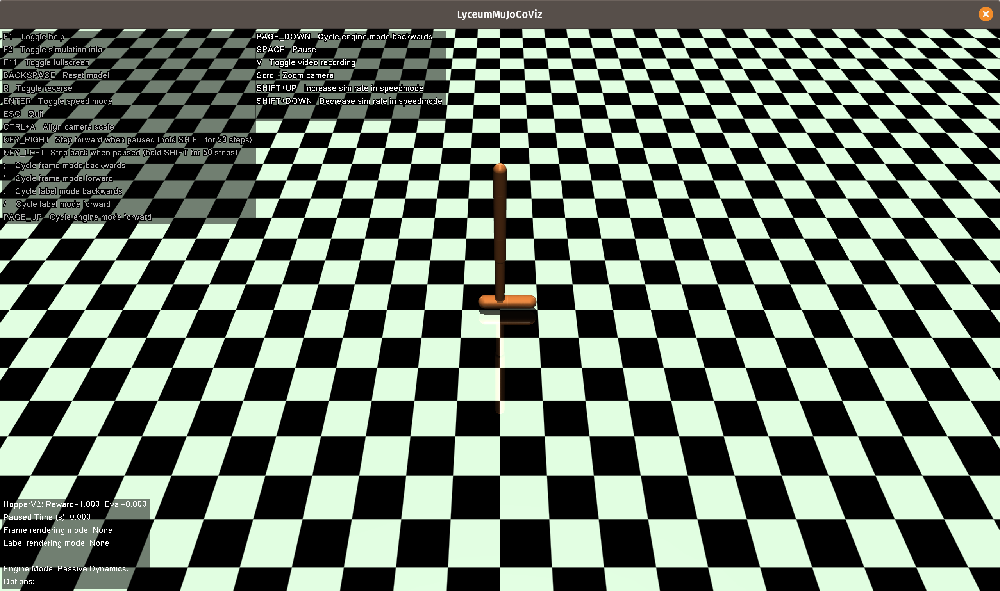

```@cfg
title = "LyceumMuJoCoViz"
weight = 0
```

```@meta
CurrentModule = LyceumDocs.LyceumMuJoCoViz
```

## Overview
LyceumMuJoCoViz is an OpenGL-based interactive visualizer for MuJoCo-based models and
environments. It allows for visualizing passive dynamics, playing back recorded trajectories,
and interacting with a policy or controller in real time. Several additional features are
provided:

- Interact with the simulation using the mouse and keyboard.
- "Burst mode", the ability to render multiple snapshots along an entire trajectory at once.
- Run the simulation faster or slower than real time, or in reverse.
- Record a high-resolution video of the rendered scene.
- Step through time, one or several timesteps at a time.

All of these commands are controlled via keyboard shortcuts which are displayed in a help
window when the visualizer is launched:

```@raw html

```

## API

```@docs
visualize
```


