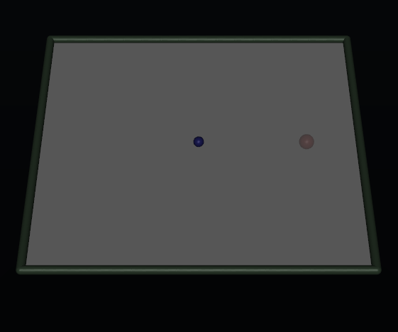
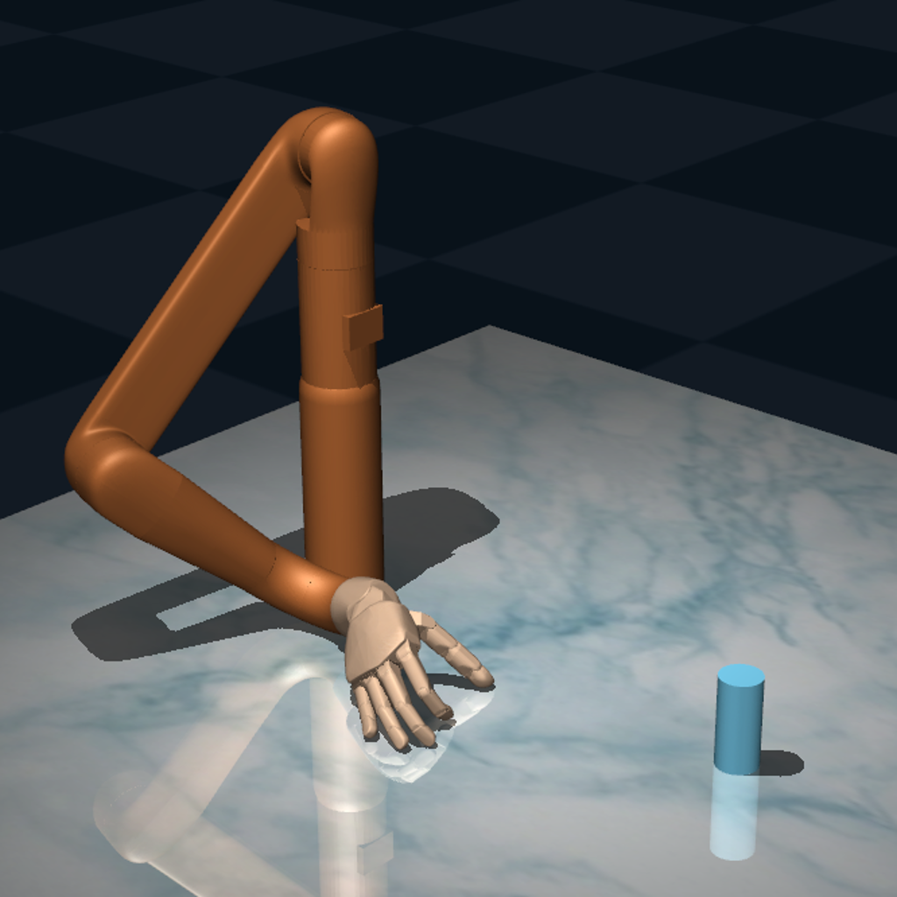
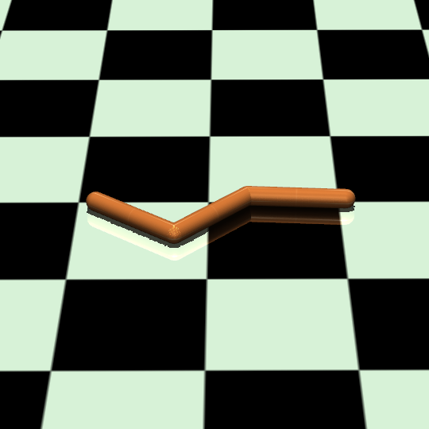
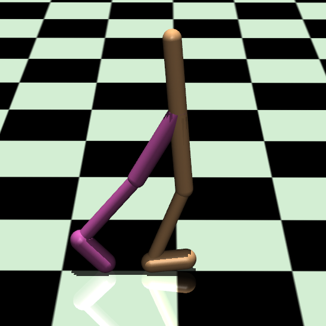
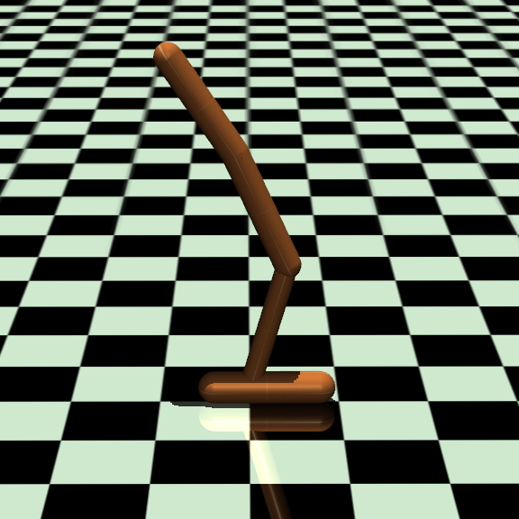
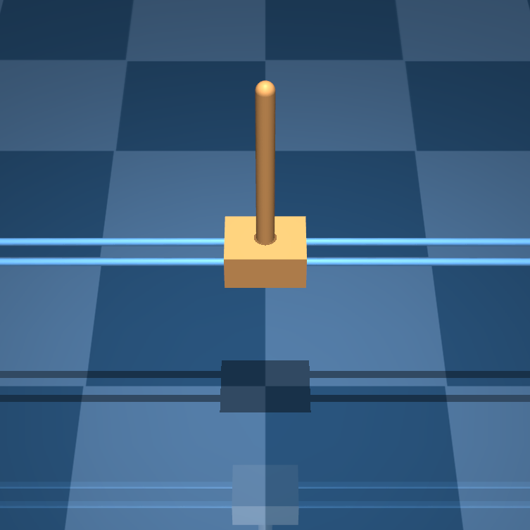

# Environments

```@meta
CurrentModule = LyceumMuJoCo
```

LyceumMuJoCo comes with a variety of environments:

* **Lyceum Suite**: A collection of Lyceum-custom environments.
* **Gym**: Ports of environments from OpenAI's [gym](https://github.com/openai/gym).
* **dm\_control**: Ports of environments from DeepMind's [dm_control](https://github.com/deepmind/dm_control)

We highly encourage that users get familiar with the source codes of these environments and
modify them as you see fit. We also hope that they serve as inspiration for creating new,
interesting environments. As always, if you make something cool we'd gladly welcome a
pull request to incorporate it into Lyceum!


# Lyceum Suite

### PointMass
```@raw html

```

```@docs
PointMass
```

### ArmHandPickup
```@raw html

```

```@docs
ArmHandPickup
```


# Gym

### SwimmerV2
```@raw html

```

```@docs
SwimmerV2
```

### Walker2DV2
```@raw html

```

```@docs
Walker2DV2
```

### HopperV2
```@raw html

```

```@docs
HopperV2
```


# dm_control

### CartpoleSwingup
```@raw html

```

```@docs
CartpoleSwingup
```
